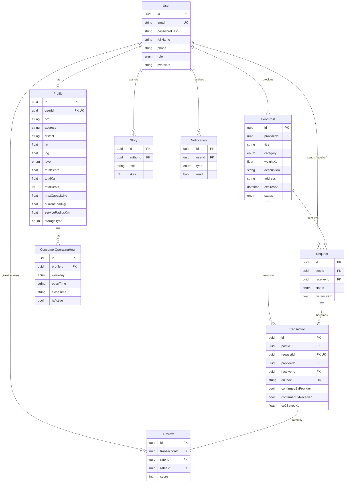

# Thiết kế Cơ sở dữ liệu — Nourish-Loop

> Bản nháp · Nguồn sự thật: [`../prisma/schema.prisma`](../prisma/schema.prisma) ·
> Field tham chiếu từ FE: `../nourish-loop/src/lib/mock-data.ts`

## 1. Tổng quan ERD

## 2. Bảng & cột

### User
Tài khoản dùng chung cho cả Provider và Receiver (phân biệt bằng `role`).

| Cột | Kiểu | Ghi chú |
|-----|------|---------|
| id | uuid (PK) | |
| email | string (unique) | đăng nhập |
| passwordHash | string | bcrypt |
| fullName | string | |
| phone | string? | |
| role | UserRole | PROVIDER / RECEIVER / ADMIN |
| avatarUrl | string? | |
| createdAt / updatedAt | datetime | |

### Profile (1–1 với User)
Thông tin tổ chức + chỉ số uy tín (gộp các field `Provider` ở mock-data).

| Cột | Kiểu | Ghi chú |
|-----|------|---------|
| userId | uuid (unique FK) | |
| org | string? | tên tổ chức |
| address, district | string? | |
| lat, lng | float? | toạ độ để tính khoảng cách |
| level | VerificationLevel | VERIFIED / COMMUNITY (badge) |
| trustScore | float (0..5) | |
| totalKg | float | tổng kg đã chia sẻ/nhận |
| totalDeals | int | |
| maxCapacityKg | float? | sức chứa tối đa của consumer (kg) |
| currentLoadKg | float? | tải hiện tại, để suy ra sức chứa còn lại |
| acceptsPreparedMeals... | boolean | consumer có nhận loại thực phẩm đó không |
| storageType | StorageType? | AMBIENT / CHILLED / FROZEN / MIXED |
| serviceRadiusKm | float? | bán kính nhận hàng tối đa |
| autoAcceptMatch | boolean | sẵn sàng auto-flow ở phase sau |
| matchingEnabled | boolean | cho phép đưa vào pool matching |

### ConsumerOperatingHour
Khung giờ hoạt động theo ngày của consumer. Đây là bảng mới, thêm vào theo kiểu additive-only, không phá
các module cũ đang dùng `Profile`.

| Cột | Kiểu | Ghi chú |
|-----|------|---------|
| profileId | uuid FK → Profile | |
| weekday | Weekday | MON..SUN |
| openTime | string | ví dụ `08:00` |
| closeTime | string | ví dụ `17:30` |
| isActive | boolean | có nhận trong ngày này không |

Unique: `(profileId, weekday)`.

### FoodPost
Tin đăng thực phẩm dư.

| Cột | Kiểu | Ghi chú |
|-----|------|---------|
| providerId | uuid FK → User | |
| title | string | |
| category | FoodCategory | 7 danh mục |
| weightKg | float | |
| description, imageUrl | string? | |
| address | string | |
| district, lat, lng | optional | |
| pickupWindow | string? | text "14:30 – 16:00 hôm nay" |
| expiresAt | datetime? | từ expiresInHours |
| status | PostStatus | OPEN/MATCHED/COMPLETED/EXPIRED |

Index: `status`, `category`, `providerId`.

### Request
Yêu cầu nhận của Receiver. Unique `(postId, receiverId)`.

| Cột | Kiểu | Ghi chú |
|-----|------|---------|
| postId | uuid FK → FoodPost | onDelete Cascade |
| receiverId | uuid FK → User | |
| status | RequestStatus | PENDING/ACCEPTED/COMPLETED/REJECTED/CANCELLED |
| distanceKm | float? | |
| message | string? | |

### Transaction
Giao dịch đã xác nhận. `requestId` và `qrCode` unique.

| Cột | Kiểu | Ghi chú |
|-----|------|---------|
| postId, requestId, providerId, receiverId | uuid FK | |
| qrCode | string (unique) | mã xác nhận |
| confirmedByProvider / confirmedByReceiver | bool | cần cả hai để hoàn tất |
| weightKg | float? | |
| co2SavedKg | float? | weightKg × hệ số carbon |
| completedAt | datetime? | |

### Review
Đánh giá hai chiều (1–5) sau giao dịch → cập nhật trustScore của `ratee`.

### Story
Câu chuyện tác động; `thanksToProviderId` trỏ tới Provider được cảm ơn; `likes`.

### Notification
Thông báo theo `type` (REQUEST/ACCEPTED/REMINDER/EXPIRING), cờ `read`. Index `(userId, read)`.

### Session
Phiên đăng nhập (auth không JWT). Mỗi lần login tạo 1 bản ghi `token` ngẫu nhiên (64 hex)
gắn `userId`, `expiresAt` (mặc định +7 ngày). Đăng xuất = xoá bản ghi theo `token`.
`token` unique, index `userId`. Chỉ domain auth dùng bảng này.

## 3. Enums
- **UserRole**: PROVIDER, RECEIVER, ADMIN
- **VerificationLevel**: VERIFIED, COMMUNITY
- **FoodCategory**: PREPARED_MEAL, BREAD_CEREAL, VEGETABLES, FRUITS, DAIRY, DRY_GOODS, OTHER
- **PostStatus**: OPEN, MATCHED, COMPLETED, EXPIRED
- **RequestStatus**: PENDING, ACCEPTED, COMPLETED, REJECTED, CANCELLED
- **NotificationType**: REQUEST, ACCEPTED, REMINDER, EXPIRING
- **StorageType**: AMBIENT, CHILLED, FROZEN, MIXED
- **Weekday**: MON, TUE, WED, THU, FRI, SAT, SUN

## 4. Business rules (cần hiện thực hoá)
1. **Trust score**: trung bình điểm Review của user, có thể trọng số theo số giao dịch. Cập nhật sau mỗi Review.
2. **Hết hạn tin**: job định kỳ chuyển FoodPost `OPEN`→`EXPIRED` khi `expiresAt < now`.
3. **CO₂ giảm**: `co2SavedKg = weightKg × CARBON_FACTOR` (hằng số cấu hình, vd ~2.5 kgCO₂/kg thực phẩm — chốt sau).
4. **Khoảng cách**: tính Haversine giữa toạ độ Receiver và FoodPost; cân nhắc PostGIS nếu cần lọc theo bán kính ở DB.
5. **Hoàn tất giao dịch**: chỉ khi `confirmedByProvider && confirmedByReceiver` → set `completedAt`,
   FoodPost→COMPLETED, Request→COMPLETED, cộng dồn totalKg/totalDeals cho cả hai Profile.
6. **Matching nhẹ cho consumer**:
   - `distanceScore`: từ `Profile.lat/lng` và `FoodPost.lat/lng`
   - `ratingScore`: từ `Profile.trustScore`
   - `capacityScore`: từ `maxCapacityKg - currentLoadKg`
   - `availabilityScore`: từ `ConsumerOperatingHour`
   - chỉ xét consumer có `matchingEnabled = true`

## 5. Ghi chú thiết kế
- Gộp Provider/Receiver vào **một bảng User + Profile** thay vì hai bảng riêng → đơn giản auth, một user có thể đóng cả hai vai trò sau này.
- `pickupWindow` để dạng text cho bản nháp; có thể tách thành `pickupStart`/`pickupEnd` (datetime) khi cần sắp xếp/lọc theo giờ.
- Cân nhắc thêm bảng **Message** (chat Provider↔Receiver) khi làm tính năng "Nhắn cho nhà cung cấp".
- Các field matching cho consumer được thêm theo kiểu **additive-only** vào `Profile` + bảng `ConsumerOperatingHour`,
  nên không phá các service/provider module hiện tại.
